# Thực hành tuần 1. BT_3

Ca 3-4 A504 18/09/2020

Link download: https://minhaskamal.github.io/DownGit/#/home?url=https://github.com/NghiLamPhuc/Matlab/tree/master/Bai_tap_thuc_hanh/BT_3/Code

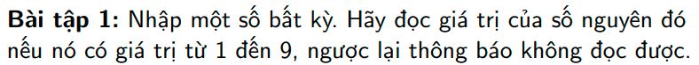
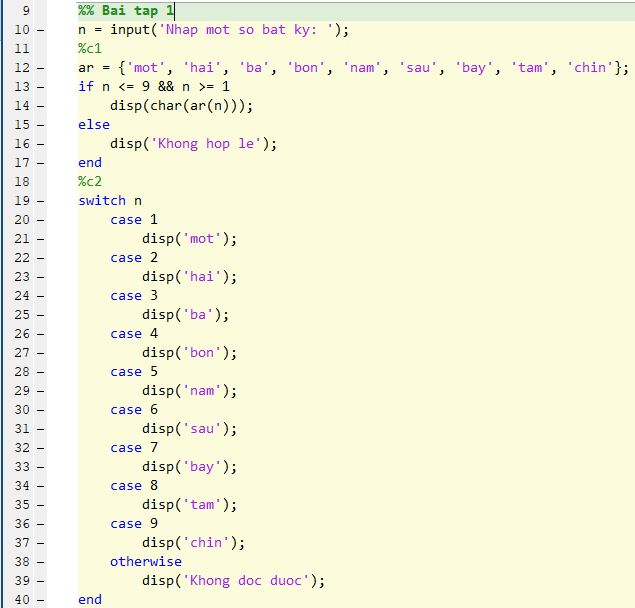

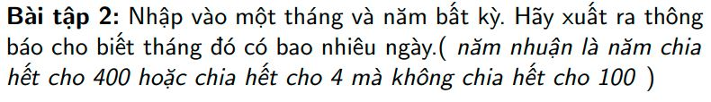
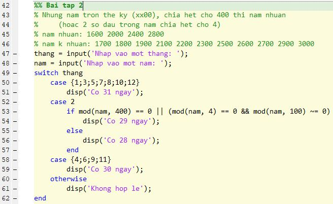

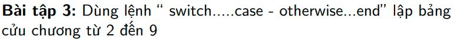
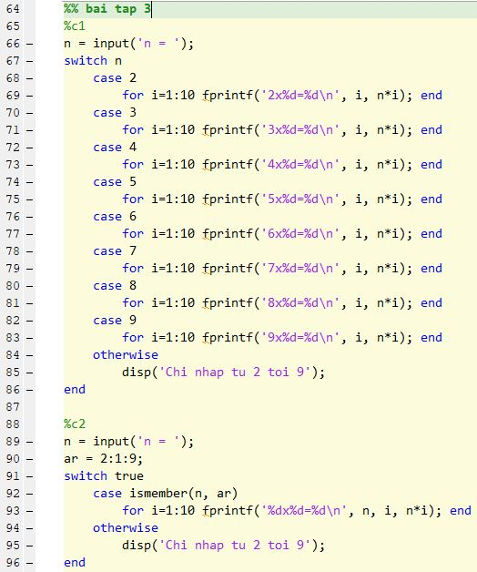

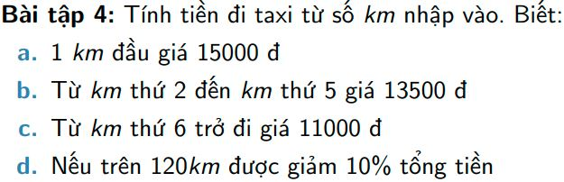
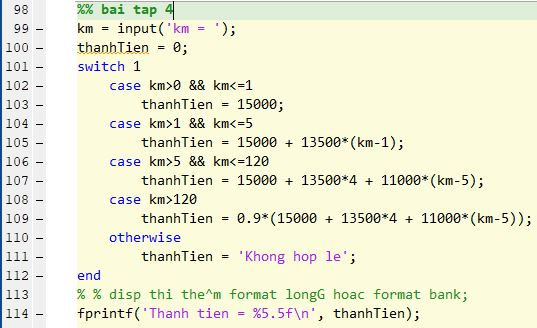

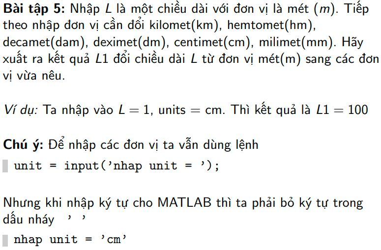
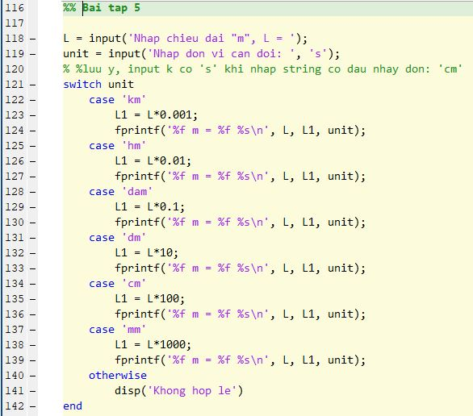

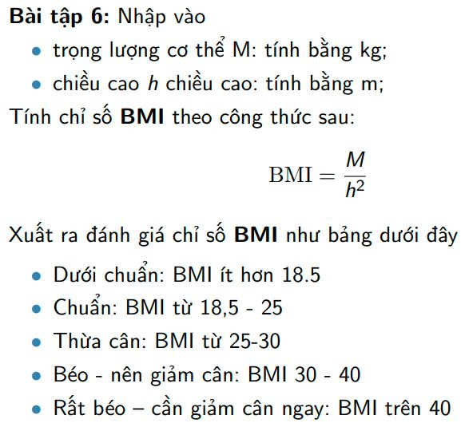
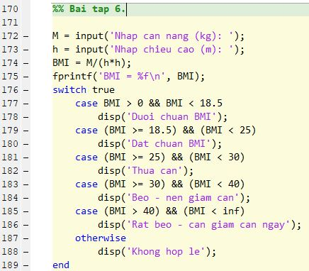

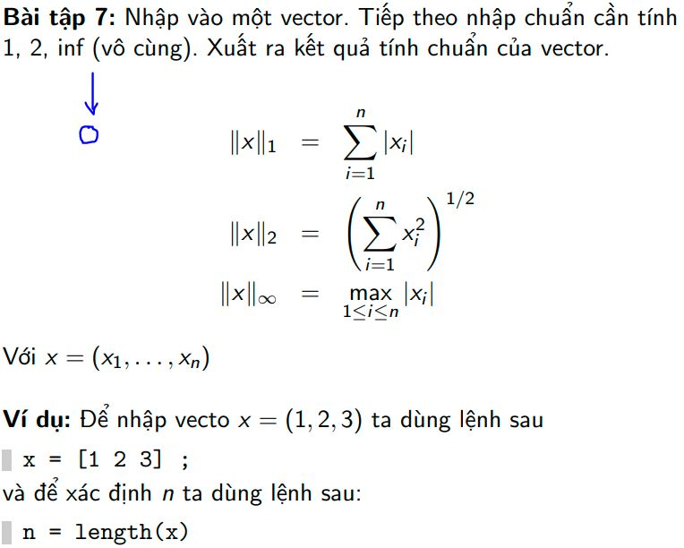
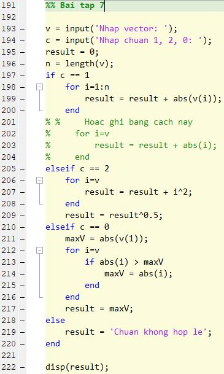

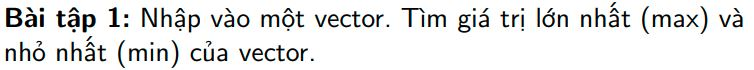
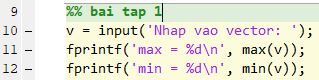

