# Thực hành tuần 4. BT_8

Ca 3-4 A504(đổi phòng A710) 16/10/2020

Link download: https://minhaskamal.github.io/DownGit/#/home?url=https://github.com/NghiLamPhuc/Matlab/tree/master/Bai_tap_thuc_hanh/BT_8/Code

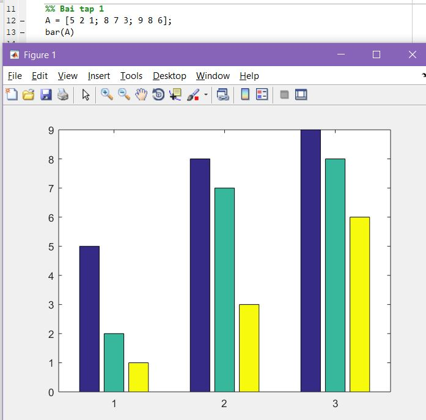
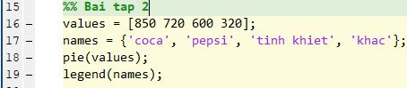
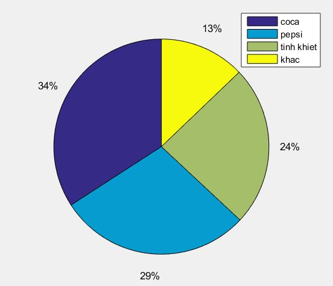

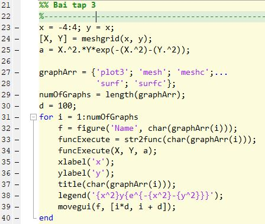
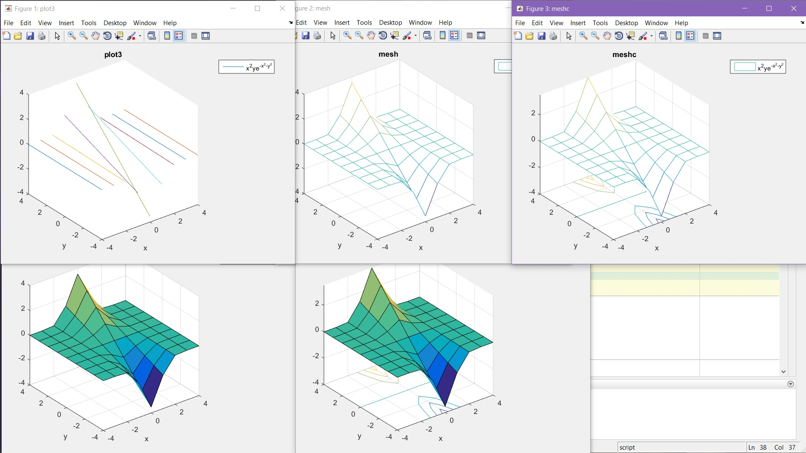
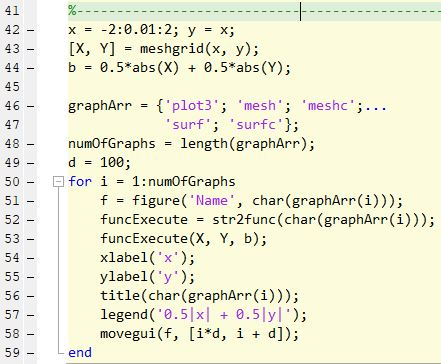
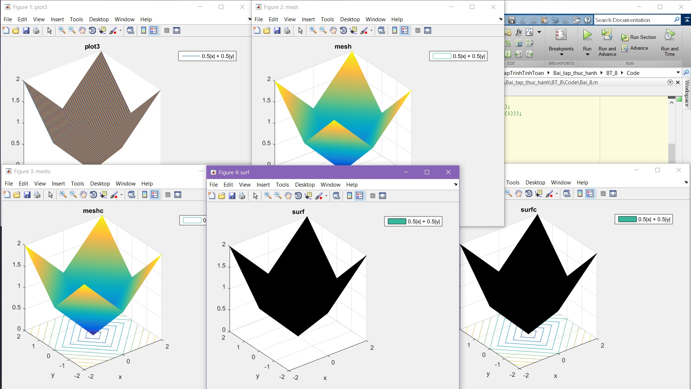
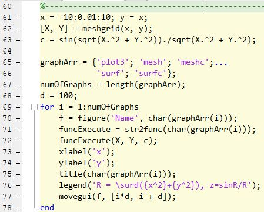
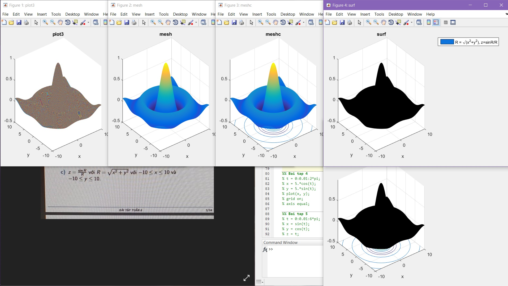

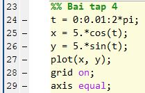
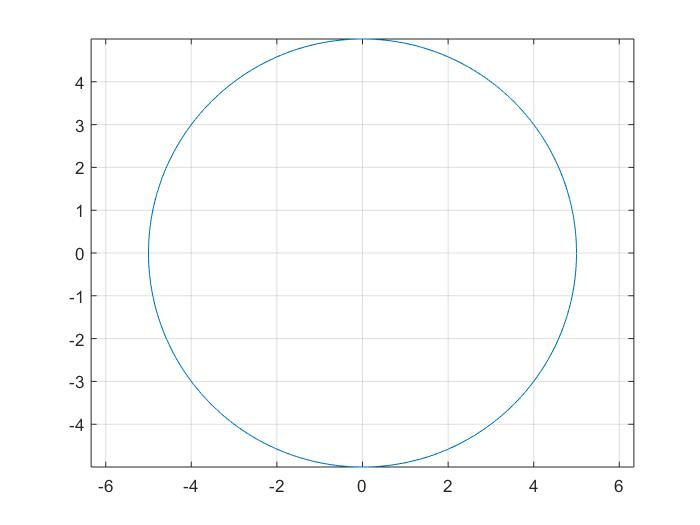

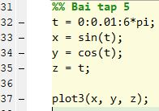
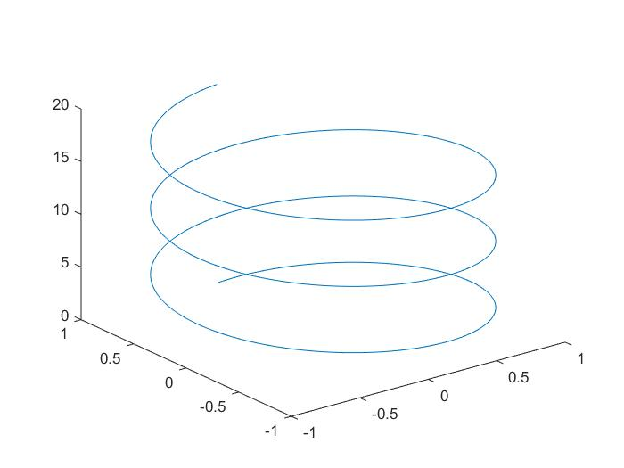

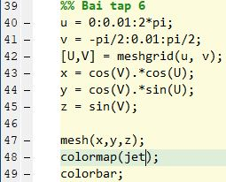
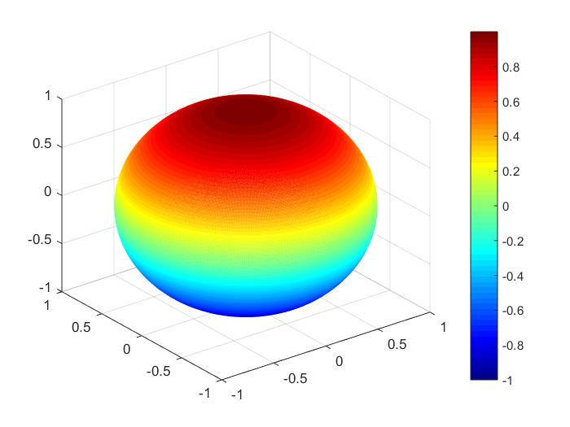

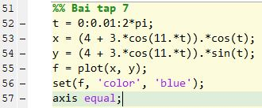
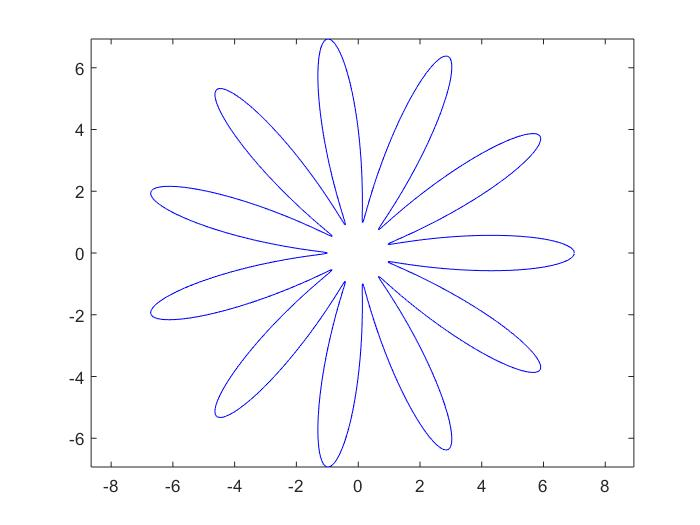

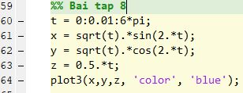
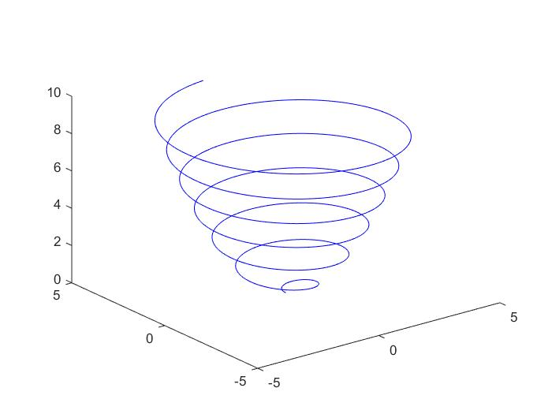

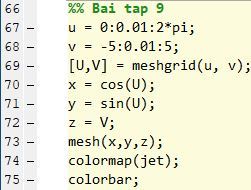
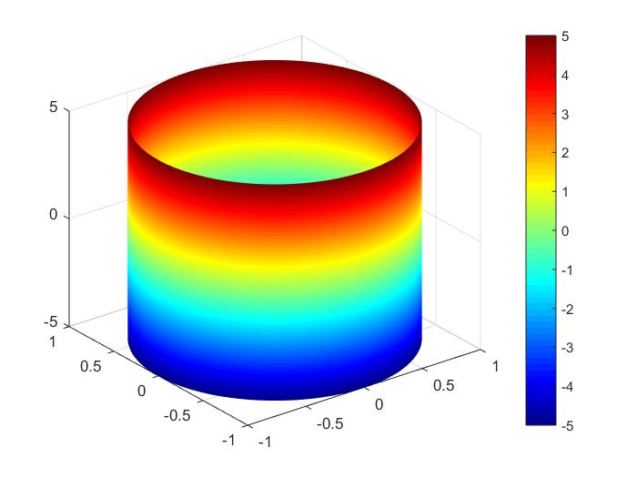

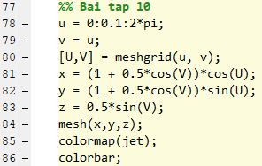
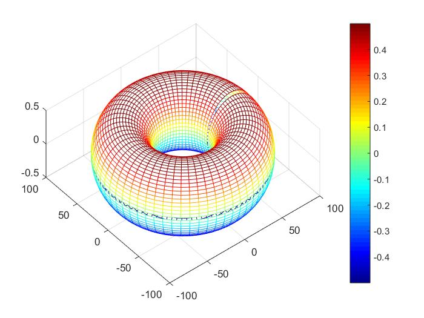

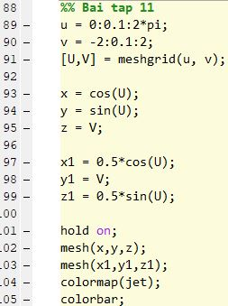
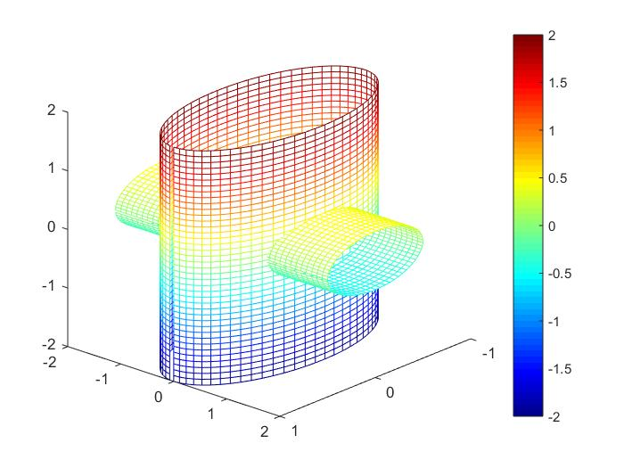

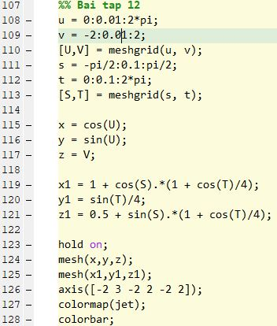
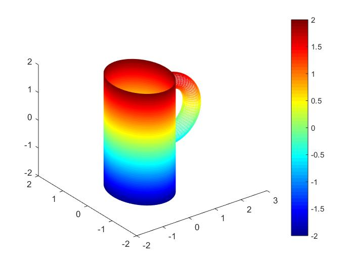

