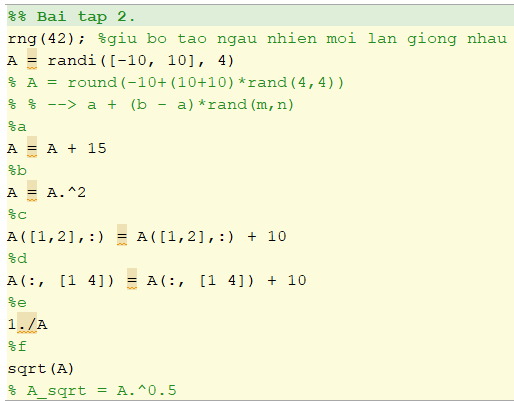
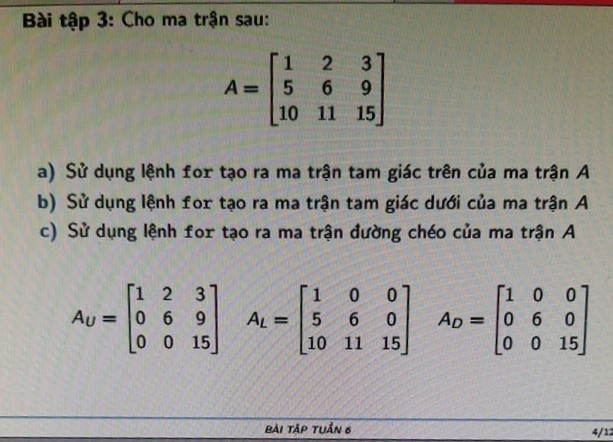
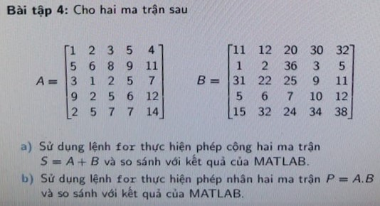
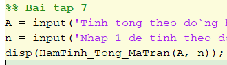
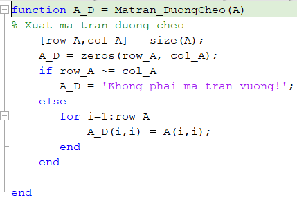
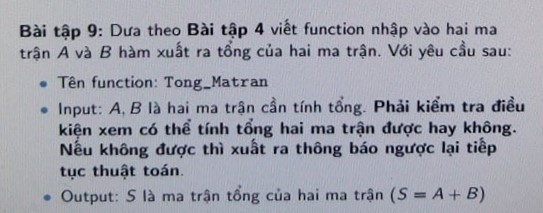

# Matlab

Lap trinh tinh toan hoc ki 1 2020 2021

# Thực hành buổi 3. BT_6
Ca 3-4, A504 , 9/10/2020

Link down buổi 3: https://minhaskamal.github.io/DownGit/#/home?url=https://github.com/NghiLamPhuc/Matlab/tree/master/TH_Buoi3

